# MemoryPoint Unified Reference (Topic-Wise)

This master document combines all source notes with full depth and no content removal, organized by topic for faster revision.

## Topic Index

1. Core Infrastructure and Platform Foundations
2. Kubernetes Access, Identity, and RBAC
3. Kubernetes Workload Fundamentals
4. Troubleshooting and Debugging Lifecycle

---
# Core Infrastructure and Platform Foundations

## Source: network-HAjenkins-ec2-ebs.md

# 🚀 DevOps Core Concepts MemoryPoint


---

# 📌  EC2 Instance Types

## Trigger Recall

EC2 instances are grouped based on **workload requirements**.

```
General Purpose
Compute Optimized
Memory Optimized
Storage Optimized
Accelerated Computing
```

---

## Core Concept

| Type              | Series         | Purpose            |
| ----------------- | -------------- | ------------------ |
| General Purpose   | T, M           | Balanced workloads |
| Compute Optimized | C              | CPU intensive apps |
| Memory Optimized  | R, X           | Large memory apps  |
| Storage Optimized | I, D           | High IOPS storage  |
| Accelerated       | P, G, Inf, Trn | GPU / ML           |

---

## Examples

| Instance | Use Case          |
| -------- | ----------------- |
| t3.micro | small web servers |
| c5.large | compute workloads |
| r5.large | memory caching    |
| i3.large | high IOPS DB      |
| p3.large | ML training       |

---

## One Sentence

EC2 instances are **categorized by compute, memory, storage, or GPU capability depending on workload requirements.**

---

# 📌  AWS EBS Internal Architecture

## Trigger Recall

EBS is **network-attached block storage for EC2**.

It behaves like a **virtual disk**.

---

## Architecture


---

## How It Works

1️⃣ EC2 sends disk request
2️⃣ Request goes through **network adapter**

3️⃣ AWS EBS service stores blocks

4️⃣ Data replicated **within Availability Zone**

Result:

```
Durable + Highly available storage
```

---

## Key Points

* Block storage
* Single EC2 attachment
* Replicated within AZ
* Low latency

---

## Example

```
EC2 → MySQL database
Database files → EBS
```

---

# 📌  AWS EFS Architecture

## Trigger Recall

EFS is **shared file storage using NFS protocol**.

Multiple EC2 instances can mount it.

---

## Architecture


---

## How It Works

1️⃣ EC2 mounts EFS via **NFS**

2️⃣ Each AZ has **Mount Target**

3️⃣ Mount targets connect to **EFS backend**

4️⃣ Many EC2 instances share the filesystem

---

## Key Points

```
Protocol → NFS
Shared storage
Auto scaling
Multi-instance access
```

---

## Example

```
Web servers share uploaded images
```

---

# 📌  Linux LVM

## Trigger Recall

LVM allows **flexible disk management**.

Structure:

```
Disk → PV → VG → LV → Filesystem
```

---

## Architecture


---

## Commands to Remember

Create PV

```bash
pvcreate /dev/xvdf
```

Create VG

```bash
vgcreate vgdata /dev/xvdf
```

Create LV

```bash
lvcreate -L 10G -n lvdata vgdata
```

Extend LV

```bash
lvextend -L +5G /dev/vgdata/lvdata
resize2fs /dev/vgdata/lvdata
```

---

## How It Works

1️⃣ Disk initialized as PV
2️⃣ PV added to VG
3️⃣ VG creates LV
4️⃣ Filesystem mounted

---

## One Sentence

LVM pools disks into **volume groups** and creates **resizable logical volumes**.

---

# 📌  Jenkins High Availability Architecture

## Trigger Recall

Jenkins HA requires **shared storage and failover mechanism**.

---

## Architecture


---

## How It Works

1️⃣ Users hit **Load Balancer**

2️⃣ LB forwards to **active Jenkins node**

3️⃣ Jenkins stores data in **EFS**

4️⃣ If primary fails:

```
Load balancer routes to standby
```

---

## Problem

Two Jenkins nodes writing simultaneously → conflict.

Solution:

```
Leader election
```

---

# 📌  ZooKeeper (Distributed Coordination)

## Trigger Recall

ZooKeeper ensures **only one active node in distributed systems**.

Features:

```
Leader election
Distributed locks
Configuration management
Cluster coordination
```

---

## Architecture


---

## How It Works

1️⃣ Nodes register in ZooKeeper

2️⃣ ZooKeeper elects **leader**

3️⃣ Only leader performs operations

4️⃣ If leader fails:

```
New leader elected
```

---

## Example

```
Jenkins HA
Kafka brokers
Hadoop cluster
```

---

# 📌  Linux Namespaces + cgroups

## Trigger Recall

Containers rely on:

```
Namespaces → isolation
cgroups → resource limits
```

---

## Namespace Types

| Namespace | Isolation                  |
| --------- | -------------------------- |
| PID       | processes                  |
| NET       | network                    |
| MNT       | filesystem                 |
| IPC       | interprocess communication |
| UTS       | hostname                   |
| USER      | users                      |

---

## cgroups Architecture


---

## cgroups v1 vs v2

| Feature    | v1       | v2            |
| ---------- | -------- | ------------- |
| Hierarchy  | multiple | unified       |
| OOM kill   | process  | entire cgroup |
| Management | complex  | simplified    |

---

## OOM Behavior

Old:

```
random process killed
```

New:

```
entire application killed
```

---

# 📌  Docker Networking

## Trigger Recall

Docker networking uses:

```
Network namespace
veth pair
Linux bridge
```

---

## veth Pair Diagram


---

## How It Works

1️⃣ Docker creates **network namespace**

2️⃣ Creates **veth pair**

3️⃣ Connects container to **docker0 bridge**

4️⃣ Bridge acts like **virtual switch**

---

## Docker LAN


Containers behave like **machines in same LAN**.

---

# 📌  Kubernetes Networking Deep Dive

## Trigger Recall

Kubernetes networking principles:

```
Every pod has IP
Pods communicate directly
No NAT required
```

---

## Cluster Network Architecture


---

## How It Works

1️⃣ Each pod gets **unique IP**

2️⃣ CNI plugin configures networking

Examples:

```
Flannel
Calico
Cilium
```

3️⃣ Overlay network connects nodes

4️⃣ Pods communicate **as if on same LAN**

---

## Pod Networking Flow


---

## One Sentence

Kubernetes networking makes **every pod reachable with a unique IP across the cluster using CNI and overlay networking.**

---

# 🧠 Ultra Short Revision

```
EC2 → compute machines
EBS → block storage disk
EFS → shared network filesystem
LVM → flexible disk management
Namespaces → isolation
cgroups → resource limits
Docker → veth + bridge networking
Kubernetes → pod networking via CNI + overlay
ZooKeeper → distributed coordination
```

---

✅ This documentation now includes

* EC2 instance types
* EBS architecture
* EFS mount targets
* LVM commands
* Jenkins HA architecture
* ZooKeeper explanation
* Namespaces & cgroups
* Docker networking
* Kubernetes networking

---

# Kubernetes Access, Identity, and RBAC

## Source: RBAC.md

# 📌  Kubernetes Access Control Flow (RBAC, ServiceAccounts, OIDC, and EKS IAM)


---

# Table of Contents

* [Trigger Recall (What I Learned)](#trigger-recall-what-i-learned)
* [Core Concept Explained](#core-concept-explained)
* [Key Components / Framework](#key-components--framework)
* [Concept Dependency Graph](#concept-dependency-graph)
* [Practical Examples](#practical-examples)
* [Common Mistakes / My Confusions](#common-mistakes--my-confusions)
* [Implementation Pattern](#implementation-pattern)
* [Commands to Remember](#commands-to-remember)
* [One-Sentence Compression](#one-sentence-compression)
* [Personal Memory Trigger](#personal-memory-trigger)
* [Revision Checkpoints](#revision-checkpoints)

---

# Trigger Recall (What I Learned)

When accessing a Kubernetes cluster, the flow usually follows:

1. **Authentication**

   * Who are you?
   * Methods: OIDC, IAM (EKS), ServiceAccount tokens.

2. **Authorization**

   * What can you do?
   * Managed using **RBAC**.

3. **RBAC Objects**

   * Role
   * ClusterRole
   * RoleBinding
   * ClusterRoleBinding

4. **Access Method**

   * Users interact with the cluster using **kubectl + kubeconfig**.

5. **Principle**

   * Always follow **least privilege access**.

---

# Core Concept Explained

Kubernetes separates **Authentication** from **Authorization**.

## Authentication

Verifies identity.

Examples:

* OIDC providers (Google, Okta, Auth0)
* AWS IAM (EKS clusters)
* ServiceAccount tokens
* Client certificates

Kubernetes itself **does NOT create human users**.

Users are authenticated **externally**.

---

## Authorization (RBAC)

Once authenticated, Kubernetes checks:

> "What is this user allowed to do?"

This is handled using **RBAC policies**.

Permissions are defined with:

| Component          | Purpose                     |
| ------------------ | --------------------------- |
| Role               | Namespace-level permissions |
| ClusterRole        | Cluster-wide permissions    |
| RoleBinding        | Assigns Role to user        |
| ClusterRoleBinding | Assigns ClusterRole to user |

---

# Key Components / Framework

## Role

Namespace-scoped permissions.

Example:

```yaml
apiVersion: rbac.authorization.k8s.io/v1
kind: Role
metadata:
  namespace: dev
  name: pod-reader
rules:
- apiGroups: [""]
  resources: ["pods"]
  verbs: ["get","list","watch"]
```

This role allows reading pods **only in the dev namespace**.

---

## ClusterRole

Cluster-wide permissions.

Example:

```yaml
kind: ClusterRole
rules:
- apiGroups: [""]
  resources: ["nodes"]
  verbs: ["get","list"]
```

Can access **nodes across the entire cluster**.

---

## RoleBinding

Assigns a Role to a user/service account **within a namespace**.

```yaml
kind: RoleBinding
subjects:
- kind: User
  name: dev-user
roleRef:
  kind: Role
  name: pod-reader
```

---

## ClusterRoleBinding

Assigns ClusterRole globally.

```yaml
kind: ClusterRoleBinding
subjects:
- kind: User
  name: admin-user
roleRef:
  kind: ClusterRole
  name: cluster-admin
```

---

## Important Insight

A **ClusterRole can be bound locally** using a **RoleBinding**.

Meaning:

Cluster permission definition
BUT applied **only in one namespace**.

---

# Concept Dependency Graph


**How to read this**

* Identity is authenticated first.
* RBAC then determines authorization.
* Roles define permissions.
* Bindings attach permissions to users.

---

# Practical Examples

## Scenario 1: DevOps Engineer Gives Dev Access

Steps:

1. Engineer creates IAM user
2. User enables MFA
3. IAM user mapped to Kubernetes
4. Dev namespace role assigned

Flow:


Explanation:

* IAM verifies identity.
* `aws-auth ConfigMap` maps IAM to Kubernetes.
* RBAC gives namespace access.

---

# Scenario 2: ServiceAccount for Automation

Used for:

* CI/CD pipelines
* Automation scripts
* Limited API access

Flow:


Explanation:

* Kubernetes generates token secrets.
* Token inserted into kubeconfig.
* kubectl authenticates using the token.

---

# Scenario 3: Self-Managed Cluster with OIDC

Flow:


Explanation:

* User logs into identity provider.
* Provider returns token.
* Token stored in kubeconfig.

---

# Common Mistakes / My Confusions

### Confusion 1

**Does Kubernetes create users internally?**

No.

Kubernetes relies on **external authentication providers**.

---

### Confusion 2

**Does a new user have default permissions?**

No.

Default access = **zero permissions**.

---

### Confusion 3

**Can a ServiceAccount act like a user?**

Yes — for automation.

But not recommended for human access.

---

### Confusion 4

**If permissions are wrong, can user get full access?**

Yes.

If bound to:

```
cluster-admin
```

They get **full cluster control**.

---

# Implementation Pattern

Typical enterprise workflow:

### Step 1

User created in:

* IAM
* OIDC provider

---

### Step 2

Authentication mapping

Examples:

EKS:

```
aws-auth ConfigMap
```

Self-managed:

```
OIDC configuration
```

---

### Step 3

RBAC roles defined

Example:

```
dev-role
test-role
prod-role
```

---

### Step 4

Bind user/group

```
RoleBinding
ClusterRoleBinding
```

---

### Step 5

User receives kubeconfig

Then uses:

```
kubectl
```

---

# Commands to Remember

### Create Role

```bash
kubectl create role pod-reader /
  --verb=get,list,watch /
  --resource=pods /
  -n dev
```

---

### Create RoleBinding

```bash
kubectl create rolebinding dev-user-binding /
  --role=pod-reader /
  --user=dev-user /
  -n dev
```

---

### Create ServiceAccount

```bash
kubectl create serviceaccount dev-sa
```

---

### Get ServiceAccount token

```bash
kubectl get secret
```

---

### Update kubeconfig for EKS

```bash
aws eks update-kubeconfig --region region --name cluster
```

---

# One-Sentence Compression

Kubernetes access works by **authenticating users externally and authorizing them internally using RBAC roles and bindings.**

---

# Personal Memory Trigger

Think of Kubernetes access like a **company building**:

| Concept        | Analogy                |
| -------------- | ---------------------- |
| Authentication | ID card verification   |
| Role           | Permission list        |
| RoleBinding    | Giving employee access |
| Namespace      | Department             |
| ClusterRole    | Company-wide access    |

---

# Revision Checkpoints

Review this concept at:

* **Day 1** → RBAC structure
* **Day 3** → ServiceAccount flow
* **Day 7** → EKS IAM integration
* **Day 30** → OIDC authentication model

---

💡 If you'd like, I can also generate a **second MemoryPoint specifically for "Kubernetes RBAC YAML patterns + real production examples"**, which is extremely useful in DevOps interviews and real cluster setups.

---

# Kubernetes Workload Fundamentals

## Source: pod.md

#  Kubernetes Pod Fundamentals


---

# Table of Contents

* [Trigger Recall (What I Learned)](#trigger-recall-what-i-learned)
* [Core Concept Explained](#core-concept-explained)
* [Key Components / Framework](#key-components--framework)
* [Practical Examples](#practical-examples)
* [Common Mistakes / My Confusions](#common-mistakes--my-confusions)
* [Implementation Pattern](#implementation-pattern)
* [Command Memory](#command-memory)
* [Concept Dependency Graph](#concept-dependency-graph)
* [One-Sentence Compression](#one-sentence-compression)
* [Personal Memory Trigger](#personal-memory-trigger)
* [Revision Checkpoints](#revision-checkpoints)

---

# Trigger Recall (What I Learned)

* A **Pod is the smallest deployable unit in Kubernetes**
* Kubernetes **does not run containers directly**
* Instead it runs **Pods that wrap containers**
* Pods provide:

  * shared networking
  * shared storage
  * shared lifecycle
* A Pod usually contains **one container**, but can contain **multiple containers (sidecar pattern)**

---

# Core Concept Explained

A **Pod** is the smallest execution unit that Kubernetes schedules onto a node.

Instead of running containers directly, Kubernetes places containers **inside Pods**, which act as a **wrapper and runtime environment**.

Pods provide three major capabilities:

1. **Shared Network**

All containers inside a Pod share the **same IP address**.

Example:

```
localhost communication between containers
```

2. **Shared Storage**

Containers can share volumes mounted into the Pod.

3. **Shared Lifecycle**

All containers in the Pod:

* start together
* stop together
* are scheduled together

---

# Key Components / Framework

A minimal Pod manifest contains four main sections.

```yaml
apiVersion:
kind:
metadata:
spec:
```

### Pod Manifest Hierarchy


**How to read this diagram**

* A **Pod object** contains metadata and specification
* The **spec defines containers**
* Each container includes runtime configuration such as image, ports, and environment variables

---

# Practical Examples

## Minimal Pod Manifest

```yaml
apiVersion: v1
kind: Pod
metadata:
  name: nginx-pod
spec:
  containers:
  - name: nginx-container
    image: nginx
```

---

## Pod with Environment Variable

```yaml
apiVersion: v1
kind: Pod
metadata:
  name: web-pod
  labels:
    app: web
spec:
  containers:
  - name: nginx
    image: nginx
    ports:
    - containerPort: 80
    env:
    - name: ENV
      value: production
```

---

## Debug Pod (Common DevOps Tool)

Used for cluster debugging.

```yaml
apiVersion: v1
kind: Pod
metadata:
  name: debug-pod
spec:
  containers:
  - name: busybox
    image: busybox
    command:
    - sh
    - -c
    - sleep 3600
```

This keeps the container alive so engineers can run:

```bash
kubectl exec
```

---

## Multi-Container Pod (Sidecar Pattern)

```yaml
apiVersion: v1
kind: Pod
metadata:
  name: sidecar-pod
spec:
  containers:
  - name: nginx
    image: nginx
  - name: helper
    image: busybox
    command:
    - sh
    - -c
    - sleep 3600
```

---

## Shared Volume Pod

```yaml
apiVersion: v1
kind: Pod
metadata:
  name: volume-pod
spec:
  containers:
  - name: writer
    image: busybox
    command:
    - sh
    - -c
    - echo hello > /data/file.txt
    volumeMounts:
    - name: shared-data
      mountPath: /data

  - name: reader
    image: busybox
    command:
    - sh
    - -c
    - sleep 3600
    volumeMounts:
    - name: shared-data
      mountPath: /data

  volumes:
  - name: shared-data
    emptyDir: {}
```

---

# Common Mistakes / My Confusions

### 1️⃣ YAML Typos

Example mistake:

```yaml
lavels:
```

Correct:

```yaml
labels:
```

Kubernetes rejects unknown fields.

---

### 2️⃣ Ports Must Be a List

Incorrect:

```yaml
ports:
  containerPort: 80
```

Correct:

```yaml
ports:
- containerPort: 80
```

---

### 3️⃣ Environment Variables Use `name`, Not `key`

Incorrect:

```yaml
env:
- key: ENV
```

Correct:

```yaml
env:
- name: ENV
```

---

### 4️⃣ Containers Field Typos

Incorrect:

```
contaiers
```

Correct:

```
containers
```

---

# Implementation Pattern

Typical Pod patterns used in production systems.

### 1️⃣ Single Container Pod

```
Pod
 └─ App Container
```

Used for simple workloads.

---

### 2️⃣ Sidecar Pattern


**Explanation**

* App writes logs
* Sidecar reads logs
* Both share the same volume

---

### 3️⃣ Debug Pod

Used by engineers to test:

* DNS
* networking
* service connectivity

---

# Command Memory

### Generate Pod YAML Quickly

```bash
kubectl run nginx-pod --image=nginx --dry-run=client -o yaml
```

---

### Create Debug Pod

```bash
kubectl run debug-pod --image=busybox -- sleep 3600
```

---

### Apply Manifest

```bash
kubectl apply -f pod.yaml
```

---

### List Pods

```bash
kubectl get pods
```

---

### Exec Into Container

```bash
kubectl exec -it pod-name -- sh
```

---

### Exec Into Specific Container (Multi-container Pod)

```bash
kubectl exec -it pod-name -c container-name -- sh
```

---

# Concept Dependency Graph


**Explanation**

Learning order:

1. Containers
2. Pods
3. Multi-container Pods
4. Volumes
5. Deployments

Pods are the **foundation for all Kubernetes workloads**.

---

# One-Sentence Compression

A **Pod is a Kubernetes wrapper that runs one or more containers sharing networking, storage, and lifecycle.**

---

# Personal Memory Trigger

Think of a **Pod as a container “pod capsule.”**

Just like a **pea pod contains peas**, a Kubernetes Pod **contains containers**.

---

# Troubleshooting and Debugging Lifecycle

## Source: troubleshoot-lifecycle.md

# 📌  DevOps Interview Core Concepts (Linux, Git, Docker, AWS, Kubernetes, CI/CD)


## 📚 Table of Contents
- [Trigger Recall (What I Learned)](#trigger-recall-what-i-learned)
- [Concept Dependency Graph](#concept-dependency-graph)
- [Core Concept Explained](#core-concept-explained)
  - [Linux Links: Hard Link vs Soft Link](#linux-links-hard-link-vs-soft-link)
  - [Linux Permissions: chmod 755](#linux-permissions-chmod-755)
  - [Git Detached HEAD](#git-detached-head)
  - [AWS EC2 Latency Troubleshooting](#aws-ec2-latency-troubleshooting)
  - [Docker Image Size Optimization](#docker-image-size-optimization)
  - [Jenkins Pipeline Test Failure Debugging](#jenkins-pipeline-test-failure-debugging)
  - [Kubernetes OOMKilled Troubleshooting](#kubernetes-oomkilled-troubleshooting)
- [Key Components / Framework](#key-components--framework)
- [Practical Examples](#practical-examples)
- [Common Mistakes / My Confusions](#common-mistakes--my-confusions)
- [Implementation Pattern](#implementation-pattern)
- [Command Memory](#command-memory)
- [One-Sentence Compression](#one-sentence-compression)
- [Personal Memory Trigger](#personal-memory-trigger)
- [Revision Checkpoints](#revision-checkpoints)

---

# Trigger Recall (What I Learned)

- **Hard links reference the same inode**; deleting the original file does not remove the data if another hard link exists.
- **Soft links store a path**; if the original file is deleted the link becomes **dangling**.
- **chmod 755** → Owner: full permissions; Group/Others: read + execute.
- **Detached HEAD in Git** happens when checking out a commit instead of a branch; commits here can be lost.
- **EC2 latency troubleshooting must start with diagnosis** (CloudWatch metrics) before scaling.
- **Docker image optimization** uses **multi-stage builds, minimal base images, and artifact cleanup**.
- **Jenkins debugging starts with console output**, not theory.
- **Kubernetes OOMKilled** usually means memory limits were exceeded; inspect pod events and logs.

---

# Concept Dependency Graph


**How to read this diagram**

* DevOps concepts build on different system layers.
* Each troubleshooting skill connects to a **specific platform responsibility**.

---

# Core Concept Explained

---

# Linux Links: Hard Link vs Soft Link

### Definition

A **hard link** is another name pointing to the **same inode and data blocks**, while a **soft link (symbolic link)** stores a **path to another file**.

### Key Behavior

| Feature                    | Hard Link | Soft Link |
| -------------------------- | --------- | --------- |
| Points to                  | Inode     | File Path |
| Same filesystem required   | Yes       | No        |
| Survives original deletion | Yes       | No        |
| Detectable as link         | No        | Yes       |


**How to read this**

* Hard links share the **same inode**.
* Soft links **point to the file path**, not the data.

---

# Linux Permissions: chmod 755

### Numeric Permission Model

| Value | Permission |
| ----- | ---------- |
| 4     | Read       |
| 2     | Write      |
| 1     | Execute    |

### chmod 755

```
Owner   = 7 = rwx
Group   = 5 = r-x
Others  = 5 = r-x
```


### Directory Behavior

* **Read** → list files
* **Write** → create/delete
* **Execute** → **traverse directory**

---

# Git Detached HEAD

### Definition

A **detached HEAD** means Git is pointing directly to a **commit instead of a branch**.

### Why It Matters

New commits made here can become **orphaned**.


**How to read**

* HEAD normally follows a **branch pointer**.
* Detached state happens when checking out a **specific commit**.

---

# AWS EC2 Latency Troubleshooting

### Correct Troubleshooting Flow


**How to read**

* Diagnose resource bottlenecks first.
* Scaling is the **last step**, not the first.

---

# Docker Image Size Optimization

### Core Techniques

1. **Multi-stage builds**
2. **Minimal base images (Alpine)**
3. **Remove build dependencies**
4. **Use .dockerignore**
5. **Combine RUN layers**


**Explanation**

* Build tools stay in the **builder stage**
* Only **final artifacts** go into production image.

---

# Jenkins Pipeline Test Failure Debugging

### Proper Debugging Order


**Explanation**

* Console logs always show the **exact failing line**.

---

# Kubernetes OOMKilled Troubleshooting

### Meaning

A container exceeded its **memory limit**.

### Investigation Steps


**Explanation**

* Kubernetes kills the container if it crosses the **memory limit set by cgroups**.

---

# Key Components / Framework

### DevOps Troubleshooting Mindset

1️⃣ **Observe**

* metrics
* logs
* events

2️⃣ **Identify Bottleneck**

* CPU
* memory
* network
* application logic

3️⃣ **Validate Root Cause**

* reproduce locally
* inspect logs

4️⃣ **Apply Fix**

* configuration
* scaling
* code change

---

# Practical Examples

### Hard Link Example

```bash
ln file.txt hardlink.txt
```

Deleting `file.txt` → `hardlink.txt` still works.

---

### Soft Link Example

```bash
ln -s file.txt symlink.txt
```

Deleting `file.txt` → `symlink.txt` becomes **dangling**.

---

### Detached HEAD Recovery

```bash
git checkout -b new-branch
```

Creates a branch from the detached commit.

---

### Kubernetes OOM Check

```bash
kubectl describe pod mypod
kubectl logs mypod
```

---

# Common Mistakes / My Confusions

### 1️⃣ Calling Hard Links “Shortcuts”

Incorrect mental model.

Hard links are **direct references to data**.

---

### 2️⃣ Jumping to Scaling Too Early

Scaling should come **after root cause analysis**.

---

### 3️⃣ Explaining Theory Instead of Debugging

Interviewers expect **step-by-step troubleshooting**, not conceptual lectures.

---

### 4️⃣ Overcomplicating Kubernetes OOM

Start simple:

* pod events
* limits
* logs

Then go deeper.

---

# Implementation Pattern

### Production Troubleshooting Pattern


**Explanation**

* Always move from **symptom → evidence → root cause → fix**.

---

# Command Memory

### Linux Links

```bash
ln source target
ln -s source symlink
```

---

### Permissions

```bash
chmod 755 file
```

---

### Git Detached HEAD Recovery

```bash
git checkout -b new-branch
git checkout main
```

---

### Kubernetes OOM Debugging

```bash
kubectl describe pod <pod>
kubectl logs <pod>
kubectl top pod
```

---

# One-Sentence Compression

DevOps troubleshooting means **diagnosing the exact system bottleneck using metrics, logs, and events before applying scaling or configuration fixes**.

---

# Personal Memory Trigger

🧠 **“Metrics → Logs → Root Cause → Fix.”**

Never scale before you **know the bottleneck**.

---

# Revision Checkpoints

| Time   | Goal                                            |
| ------ | ----------------------------------------------- |
| Day 1  | Review Linux links and chmod permissions        |
| Day 3  | Practice Git detached HEAD recovery             |
| Day 7  | Rehearse AWS + Kubernetes troubleshooting flows |
| Day 30 | Simulate DevOps interview answers               |

---

✅ This MemoryPoint now covers **7 major DevOps interview concepts** frequently asked in **SRE / DevOps / Cloud engineer interviews**.

`n

---


