# 📌  Kubernetes Access Control Flow (RBAC, ServiceAccounts, OIDC, and EKS IAM)


---

# Table of Contents

* [Trigger Recall (What I Learned)](#trigger-recall-what-i-learned)
* [Core Concept Explained](#core-concept-explained)
* [Key Components / Framework](#key-components--framework)
* [Concept Dependency Graph](#concept-dependency-graph)
* [Practical Examples](#practical-examples)
* [Common Mistakes / My Confusions](#common-mistakes--my-confusions)
* [Implementation Pattern](#implementation-pattern)
* [Commands to Remember](#commands-to-remember)
* [One-Sentence Compression](#one-sentence-compression)
* [Personal Memory Trigger](#personal-memory-trigger)
* [Revision Checkpoints](#revision-checkpoints)

---

# Trigger Recall (What I Learned)

When accessing a Kubernetes cluster, the flow usually follows:

1. **Authentication**

   * Who are you?
   * Methods: OIDC, IAM (EKS), ServiceAccount tokens.

2. **Authorization**

   * What can you do?
   * Managed using **RBAC**.

3. **RBAC Objects**

   * Role
   * ClusterRole
   * RoleBinding
   * ClusterRoleBinding

4. **Access Method**

   * Users interact with the cluster using **kubectl + kubeconfig**.

5. **Principle**

   * Always follow **least privilege access**.

---

# Core Concept Explained

Kubernetes separates **Authentication** from **Authorization**.

## Authentication

Verifies identity.

Examples:

* OIDC providers (Google, Okta, Auth0)
* AWS IAM (EKS clusters)
* ServiceAccount tokens
* Client certificates

Kubernetes itself **does NOT create human users**.

Users are authenticated **externally**.

---

## Authorization (RBAC)

Once authenticated, Kubernetes checks:

> "What is this user allowed to do?"

This is handled using **RBAC policies**.

Permissions are defined with:

| Component          | Purpose                     |
| ------------------ | --------------------------- |
| Role               | Namespace-level permissions |
| ClusterRole        | Cluster-wide permissions    |
| RoleBinding        | Assigns Role to user        |
| ClusterRoleBinding | Assigns ClusterRole to user |

---

# Key Components / Framework

## Role

Namespace-scoped permissions.

Example:

```yaml
apiVersion: rbac.authorization.k8s.io/v1
kind: Role
metadata:
  namespace: dev
  name: pod-reader
rules:
- apiGroups: [""]
  resources: ["pods"]
  verbs: ["get","list","watch"]
```

This role allows reading pods **only in the dev namespace**.

---

## ClusterRole

Cluster-wide permissions.

Example:

```yaml
kind: ClusterRole
rules:
- apiGroups: [""]
  resources: ["nodes"]
  verbs: ["get","list"]
```

Can access **nodes across the entire cluster**.

---

## RoleBinding

Assigns a Role to a user/service account **within a namespace**.

```yaml
kind: RoleBinding
subjects:
- kind: User
  name: dev-user
roleRef:
  kind: Role
  name: pod-reader
```

---

## ClusterRoleBinding

Assigns ClusterRole globally.

```yaml
kind: ClusterRoleBinding
subjects:
- kind: User
  name: admin-user
roleRef:
  kind: ClusterRole
  name: cluster-admin
```

---

## Important Insight

A **ClusterRole can be bound locally** using a **RoleBinding**.

Meaning:

Cluster permission definition
BUT applied **only in one namespace**.

---

# Concept Dependency Graph



**How to read this**

* Identity is authenticated first.
* RBAC then determines authorization.
* Roles define permissions.
* Bindings attach permissions to users.

---

# Practical Examples

## Scenario 1: DevOps Engineer Gives Dev Access

Steps:

1. Engineer creates IAM user
2. User enables MFA
3. IAM user mapped to Kubernetes
4. Dev namespace role assigned

Flow:


Explanation:

* IAM verifies identity.
* `aws-auth ConfigMap` maps IAM to Kubernetes.
* RBAC gives namespace access.

---

# Scenario 2: ServiceAccount for Automation

Used for:

* CI/CD pipelines
* Automation scripts
* Limited API access

Flow:


Explanation:

* Kubernetes generates token secrets.
* Token inserted into kubeconfig.
* kubectl authenticates using the token.

---

# Scenario 3: Self-Managed Cluster with OIDC

Flow:


Explanation:

* User logs into identity provider.
* Provider returns token.
* Token stored in kubeconfig.

---

# Common Mistakes / My Confusions

### Confusion 1

**Does Kubernetes create users internally?**

No.

Kubernetes relies on **external authentication providers**.

---

### Confusion 2

**Does a new user have default permissions?**

No.

Default access = **zero permissions**.

---

### Confusion 3

**Can a ServiceAccount act like a user?**

Yes — for automation.

But not recommended for human access.

---

### Confusion 4

**If permissions are wrong, can user get full access?**

Yes.

If bound to:

```
cluster-admin
```

They get **full cluster control**.

---

# Implementation Pattern

Typical enterprise workflow:

### Step 1

User created in:

* IAM
* OIDC provider

---

### Step 2

Authentication mapping

Examples:

EKS:

```
aws-auth ConfigMap
```

Self-managed:

```
OIDC configuration
```

---

### Step 3

RBAC roles defined

Example:

```
dev-role
test-role
prod-role
```

---

### Step 4

Bind user/group

```
RoleBinding
ClusterRoleBinding
```

---

### Step 5

User receives kubeconfig

Then uses:

```
kubectl
```

---

# Commands to Remember

### Create Role

```bash
kubectl create role pod-reader /
  --verb=get,list,watch /
  --resource=pods /
  -n dev
```

---

### Create RoleBinding

```bash
kubectl create rolebinding dev-user-binding /
  --role=pod-reader /
  --user=dev-user /
  -n dev
```

---

### Create ServiceAccount

```bash
kubectl create serviceaccount dev-sa
```

---

### Get ServiceAccount token

```bash
kubectl get secret
```

---

### Update kubeconfig for EKS

```bash
aws eks update-kubeconfig --region region --name cluster
```

---

# One-Sentence Compression

Kubernetes access works by **authenticating users externally and authorizing them internally using RBAC roles and bindings.**

---

# Personal Memory Trigger

Think of Kubernetes access like a **company building**:

| Concept        | Analogy                |
| -------------- | ---------------------- |
| Authentication | ID card verification   |
| Role           | Permission list        |
| RoleBinding    | Giving employee access |
| Namespace      | Department             |
| ClusterRole    | Company-wide access    |

---

# Revision Checkpoints

Review this concept at:

* **Day 1** → RBAC structure
* **Day 3** → ServiceAccount flow
* **Day 7** → EKS IAM integration
* **Day 30** → OIDC authentication model

---

💡 If you'd like, I can also generate a **second MemoryPoint specifically for "Kubernetes RBAC YAML patterns + real production examples"**, which is extremely useful in DevOps interviews and real cluster setups.

