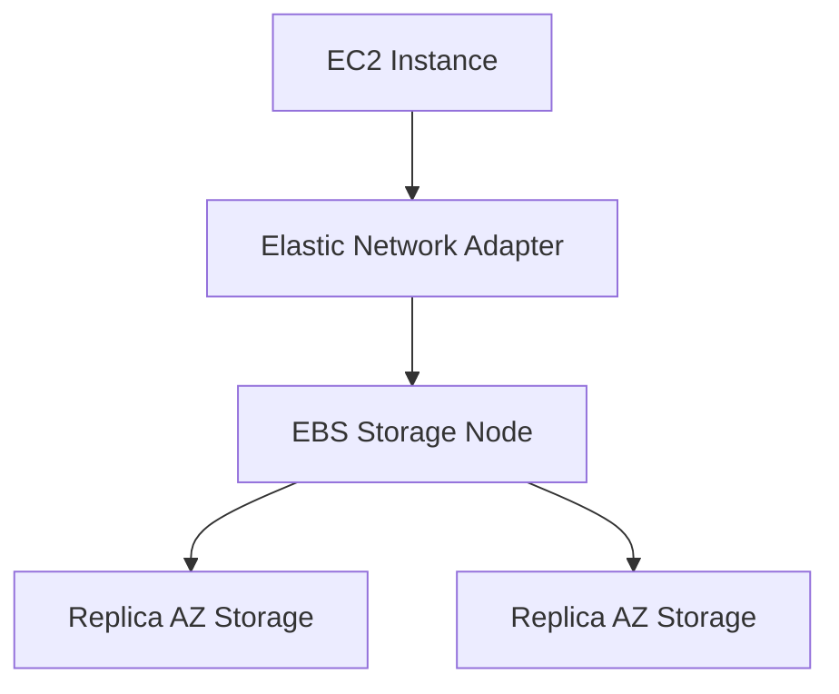
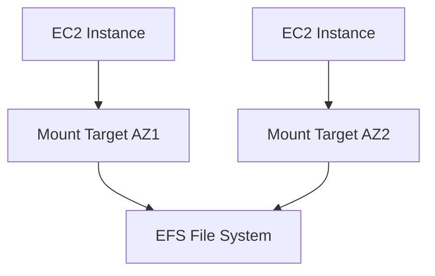
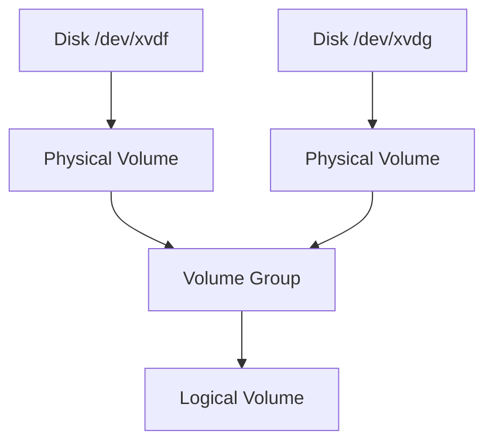
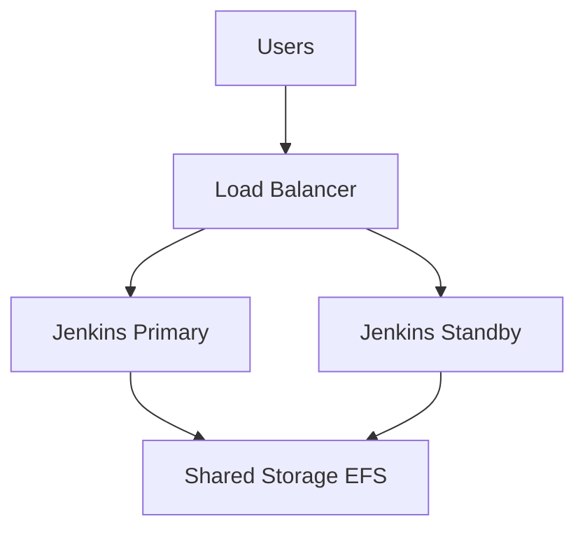
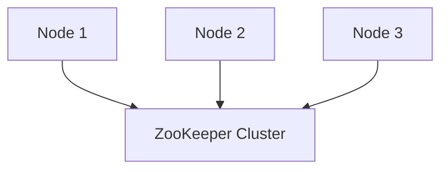
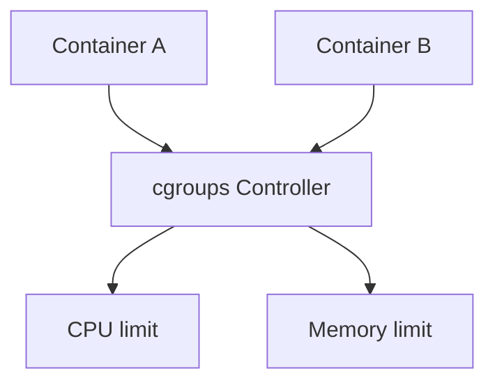
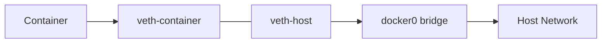
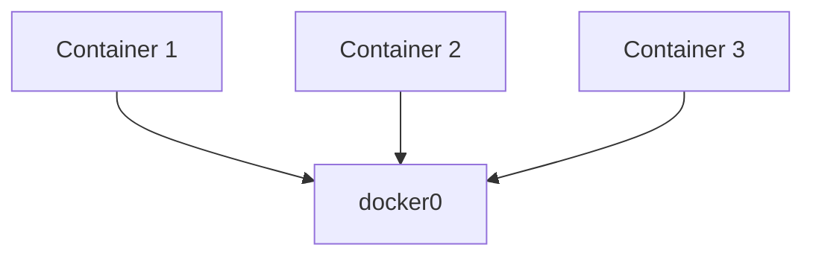
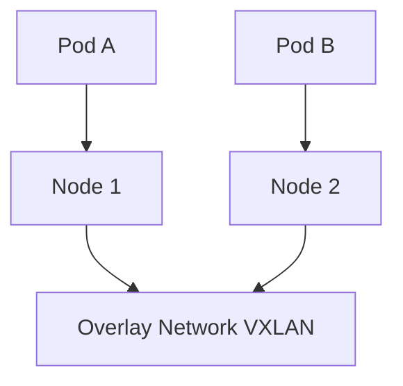
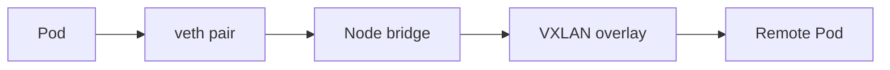

# 🚀 DevOps Core Concepts MemoryPoint


---

# 📌  EC2 Instance Types

## Trigger Recall

EC2 instances are grouped based on **workload requirements**.

```
General Purpose
Compute Optimized
Memory Optimized
Storage Optimized
Accelerated Computing
```

---

## Core Concept

| Type              | Series         | Purpose            |
| ----------------- | -------------- | ------------------ |
| General Purpose   | T, M           | Balanced workloads |
| Compute Optimized | C              | CPU intensive apps |
| Memory Optimized  | R, X           | Large memory apps  |
| Storage Optimized | I, D           | High IOPS storage  |
| Accelerated       | P, G, Inf, Trn | GPU / ML           |

---

## Examples

| Instance | Use Case          |
| -------- | ----------------- |
| t3.micro | small web servers |
| c5.large | compute workloads |
| r5.large | memory caching    |
| i3.large | high IOPS DB      |
| p3.large | ML training       |

---

## One Sentence

EC2 instances are **categorized by compute, memory, storage, or GPU capability depending on workload requirements.**

---

# 📌  AWS EBS Internal Architecture

## Trigger Recall

EBS is **network-attached block storage for EC2**.

It behaves like a **virtual disk**.

---

## Architecture



---

## How It Works

1️⃣ EC2 sends disk request
2️⃣ Request goes through **network adapter**

3️⃣ AWS EBS service stores blocks

4️⃣ Data replicated **within Availability Zone**

Result:

```
Durable + Highly available storage
```

---

## Key Points

* Block storage
* Single EC2 attachment
* Replicated within AZ
* Low latency

---

## Example

```
EC2 → MySQL database
Database files → EBS
```

---

# 📌  AWS EFS Architecture

## Trigger Recall

EFS is **shared file storage using NFS protocol**.

Multiple EC2 instances can mount it.

---

## Architecture



---

## How It Works

1️⃣ EC2 mounts EFS via **NFS**

2️⃣ Each AZ has **Mount Target**

3️⃣ Mount targets connect to **EFS backend**

4️⃣ Many EC2 instances share the filesystem

---

## Key Points

```
Protocol → NFS
Shared storage
Auto scaling
Multi-instance access
```

---

## Example

```
Web servers share uploaded images
```

---

# 📌  Linux LVM

## Trigger Recall

LVM allows **flexible disk management**.

Structure:

```
Disk → PV → VG → LV → Filesystem
```

---

## Architecture



---

## Commands to Remember

Create PV

```bash
pvcreate /dev/xvdf
```

Create VG

```bash
vgcreate vgdata /dev/xvdf
```

Create LV

```bash
lvcreate -L 10G -n lvdata vgdata
```

Extend LV

```bash
lvextend -L +5G /dev/vgdata/lvdata
resize2fs /dev/vgdata/lvdata
```

---

## How It Works

1️⃣ Disk initialized as PV
2️⃣ PV added to VG
3️⃣ VG creates LV
4️⃣ Filesystem mounted

---

## One Sentence

LVM pools disks into **volume groups** and creates **resizable logical volumes**.

---

# 📌  Jenkins High Availability Architecture

## Trigger Recall

Jenkins HA requires **shared storage and failover mechanism**.

---

## Architecture



---

## How It Works

1️⃣ Users hit **Load Balancer**

2️⃣ LB forwards to **active Jenkins node**

3️⃣ Jenkins stores data in **EFS**

4️⃣ If primary fails:

```
Load balancer routes to standby
```

---

## Problem

Two Jenkins nodes writing simultaneously → conflict.

Solution:

```
Leader election
```

---

# 📌  ZooKeeper (Distributed Coordination)

## Trigger Recall

ZooKeeper ensures **only one active node in distributed systems**.

Features:

```
Leader election
Distributed locks
Configuration management
Cluster coordination
```

---

## Architecture



---

## How It Works

1️⃣ Nodes register in ZooKeeper

2️⃣ ZooKeeper elects **leader**

3️⃣ Only leader performs operations

4️⃣ If leader fails:

```
New leader elected
```

---

## Example

```
Jenkins HA
Kafka brokers
Hadoop cluster
```

---

# 📌  Linux Namespaces + cgroups

## Trigger Recall

Containers rely on:

```
Namespaces → isolation
cgroups → resource limits
```

---

## Namespace Types

| Namespace | Isolation                  |
| --------- | -------------------------- |
| PID       | processes                  |
| NET       | network                    |
| MNT       | filesystem                 |
| IPC       | interprocess communication |
| UTS       | hostname                   |
| USER      | users                      |

---

## cgroups Architecture



---

## cgroups v1 vs v2

| Feature    | v1       | v2            |
| ---------- | -------- | ------------- |
| Hierarchy  | multiple | unified       |
| OOM kill   | process  | entire cgroup |
| Management | complex  | simplified    |

---

## OOM Behavior

Old:

```
random process killed
```

New:

```
entire application killed
```

---

# 📌  Docker Networking

## Trigger Recall

Docker networking uses:

```
Network namespace
veth pair
Linux bridge
```

---

## veth Pair Diagram



---

## How It Works

1️⃣ Docker creates **network namespace**

2️⃣ Creates **veth pair**

3️⃣ Connects container to **docker0 bridge**

4️⃣ Bridge acts like **virtual switch**

---

## Docker LAN



Containers behave like **machines in same LAN**.

---

# 📌  Kubernetes Networking Deep Dive

## Trigger Recall

Kubernetes networking principles:

```
Every pod has IP
Pods communicate directly
No NAT required
```

---

## Cluster Network Architecture



---

## How It Works

1️⃣ Each pod gets **unique IP**

2️⃣ CNI plugin configures networking

Examples:

```
Flannel
Calico
Cilium
```

3️⃣ Overlay network connects nodes

4️⃣ Pods communicate **as if on same LAN**

---

## Pod Networking Flow



---

## One Sentence

Kubernetes networking makes **every pod reachable with a unique IP across the cluster using CNI and overlay networking.**

---

# 🧠 Ultra Short Revision

```
EC2 → compute machines
EBS → block storage disk
EFS → shared network filesystem
LVM → flexible disk management
Namespaces → isolation
cgroups → resource limits
Docker → veth + bridge networking
Kubernetes → pod networking via CNI + overlay
ZooKeeper → distributed coordination
```

---

✅ This documentation now includes

* EC2 instance types
* EBS architecture
* EFS mount targets
* LVM commands
* Jenkins HA architecture
* ZooKeeper explanation
* Namespaces & cgroups
* Docker networking
* Kubernetes networking


