#  Kubernetes Pod Fundamentals


---

# Table of Contents

* [Trigger Recall (What I Learned)](#trigger-recall-what-i-learned)
* [Core Concept Explained](#core-concept-explained)
* [Key Components / Framework](#key-components--framework)
* [Practical Examples](#practical-examples)
* [Common Mistakes / My Confusions](#common-mistakes--my-confusions)
* [Implementation Pattern](#implementation-pattern)
* [Command Memory](#command-memory)
* [Concept Dependency Graph](#concept-dependency-graph)
* [One-Sentence Compression](#one-sentence-compression)
* [Personal Memory Trigger](#personal-memory-trigger)
* [Revision Checkpoints](#revision-checkpoints)

---

# Trigger Recall (What I Learned)

* A **Pod is the smallest deployable unit in Kubernetes**
* Kubernetes **does not run containers directly**
* Instead it runs **Pods that wrap containers**
* Pods provide:

  * shared networking
  * shared storage
  * shared lifecycle
* A Pod usually contains **one container**, but can contain **multiple containers (sidecar pattern)**

---

# Core Concept Explained

A **Pod** is the smallest execution unit that Kubernetes schedules onto a node.

Instead of running containers directly, Kubernetes places containers **inside Pods**, which act as a **wrapper and runtime environment**.

Pods provide three major capabilities:

1. **Shared Network**

All containers inside a Pod share the **same IP address**.

Example:

```
localhost communication between containers
```

2. **Shared Storage**

Containers can share volumes mounted into the Pod.

3. **Shared Lifecycle**

All containers in the Pod:

* start together
* stop together
* are scheduled together

---

# Key Components / Framework

A minimal Pod manifest contains four main sections.

```yaml
apiVersion:
kind:
metadata:
spec:
```

### Pod Manifest Hierarchy



**How to read this diagram**

* A **Pod object** contains metadata and specification
* The **spec defines containers**
* Each container includes runtime configuration such as image, ports, and environment variables

---

# Practical Examples

## Minimal Pod Manifest

```yaml
apiVersion: v1
kind: Pod
metadata:
  name: nginx-pod
spec:
  containers:
  - name: nginx-container
    image: nginx
```

---

## Pod with Environment Variable

```yaml
apiVersion: v1
kind: Pod
metadata:
  name: web-pod
  labels:
    app: web
spec:
  containers:
  - name: nginx
    image: nginx
    ports:
    - containerPort: 80
    env:
    - name: ENV
      value: production
```

---

## Debug Pod (Common DevOps Tool)

Used for cluster debugging.

```yaml
apiVersion: v1
kind: Pod
metadata:
  name: debug-pod
spec:
  containers:
  - name: busybox
    image: busybox
    command:
    - sh
    - -c
    - sleep 3600
```

This keeps the container alive so engineers can run:

```bash
kubectl exec
```

---

## Multi-Container Pod (Sidecar Pattern)

```yaml
apiVersion: v1
kind: Pod
metadata:
  name: sidecar-pod
spec:
  containers:
  - name: nginx
    image: nginx
  - name: helper
    image: busybox
    command:
    - sh
    - -c
    - sleep 3600
```

---

## Shared Volume Pod

```yaml
apiVersion: v1
kind: Pod
metadata:
  name: volume-pod
spec:
  containers:
  - name: writer
    image: busybox
    command:
    - sh
    - -c
    - echo hello > /data/file.txt
    volumeMounts:
    - name: shared-data
      mountPath: /data

  - name: reader
    image: busybox
    command:
    - sh
    - -c
    - sleep 3600
    volumeMounts:
    - name: shared-data
      mountPath: /data

  volumes:
  - name: shared-data
    emptyDir: {}
```

---

# Common Mistakes / My Confusions

### 1️⃣ YAML Typos

Example mistake:

```yaml
lavels:
```

Correct:

```yaml
labels:
```

Kubernetes rejects unknown fields.

---

### 2️⃣ Ports Must Be a List

Incorrect:

```yaml
ports:
  containerPort: 80
```

Correct:

```yaml
ports:
- containerPort: 80
```

---

### 3️⃣ Environment Variables Use `name`, Not `key`

Incorrect:

```yaml
env:
- key: ENV
```

Correct:

```yaml
env:
- name: ENV
```

---

### 4️⃣ Containers Field Typos

Incorrect:

```
contaiers
```

Correct:

```
containers
```

---

# Implementation Pattern

Typical Pod patterns used in production systems.

### 1️⃣ Single Container Pod

```
Pod
 └─ App Container
```

Used for simple workloads.

---

### 2️⃣ Sidecar Pattern



**Explanation**

* App writes logs
* Sidecar reads logs
* Both share the same volume

---

### 3️⃣ Debug Pod

Used by engineers to test:

* DNS
* networking
* service connectivity

---

# Command Memory

### Generate Pod YAML Quickly

```bash
kubectl run nginx-pod --image=nginx --dry-run=client -o yaml
```

---

### Create Debug Pod

```bash
kubectl run debug-pod --image=busybox -- sleep 3600
```

---

### Apply Manifest

```bash
kubectl apply -f pod.yaml
```

---

### List Pods

```bash
kubectl get pods
```

---

### Exec Into Container

```bash
kubectl exec -it pod-name -- sh
```

---

### Exec Into Specific Container (Multi-container Pod)

```bash
kubectl exec -it pod-name -c container-name -- sh
```

---

# Concept Dependency Graph



**Explanation**

Learning order:

1. Containers
2. Pods
3. Multi-container Pods
4. Volumes
5. Deployments

Pods are the **foundation for all Kubernetes workloads**.

---

# One-Sentence Compression

A **Pod is a Kubernetes wrapper that runs one or more containers sharing networking, storage, and lifecycle.**

---

# Personal Memory Trigger

Think of a **Pod as a container “pod capsule.”**

Just like a **pea pod contains peas**, a Kubernetes Pod **contains containers**.


