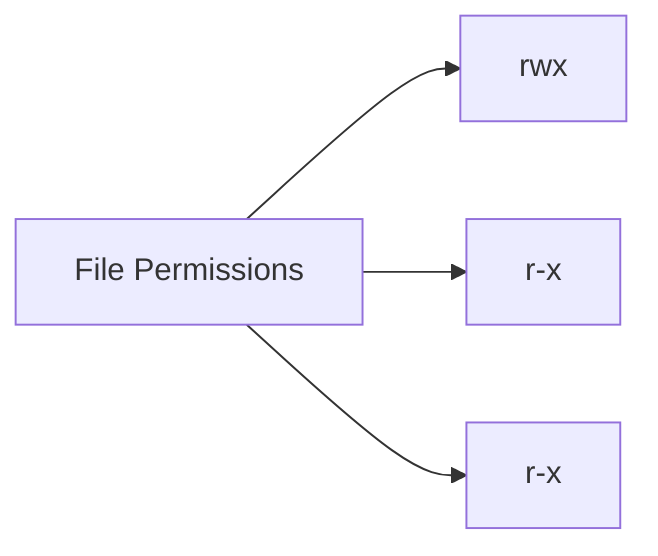
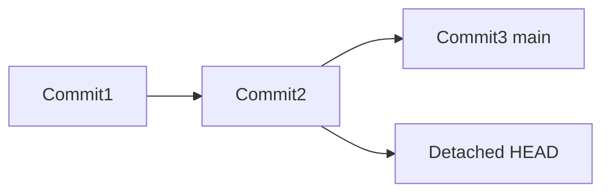
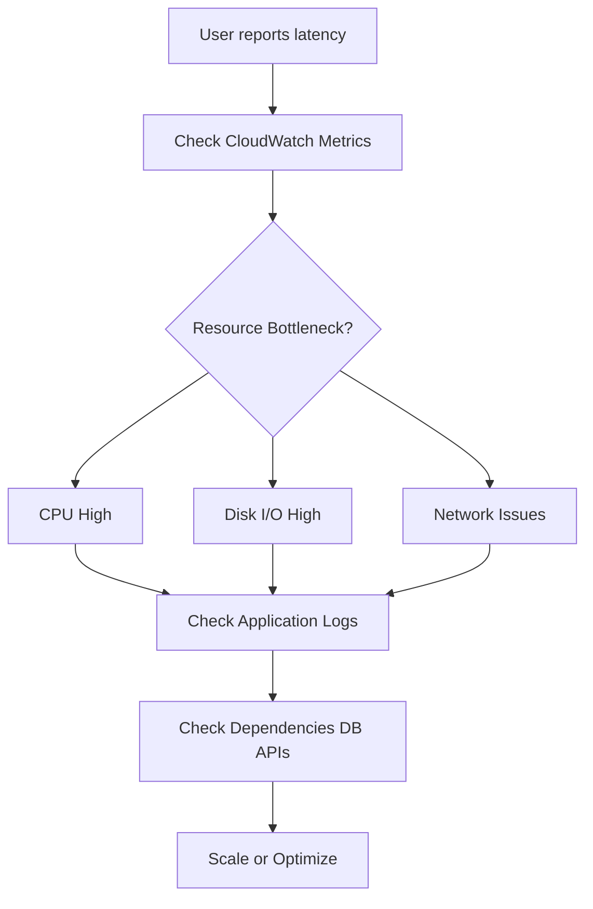
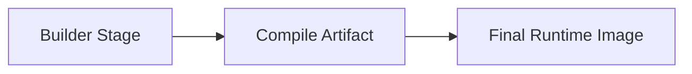
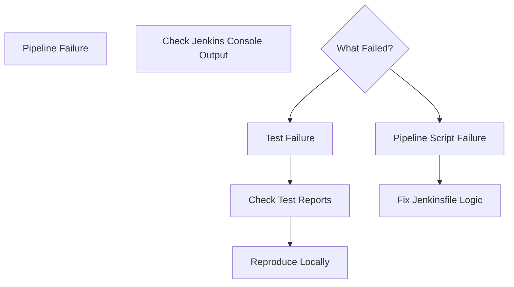
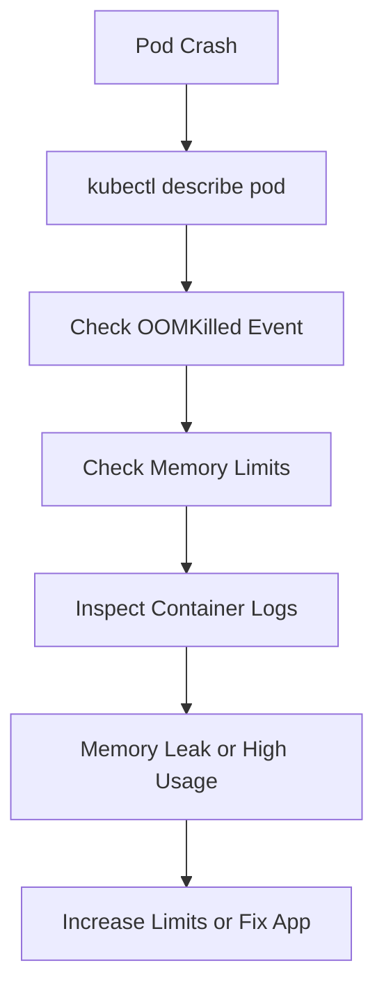
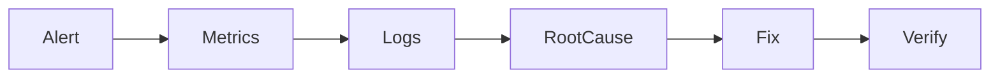

# 📌  DevOps Interview Core Concepts (Linux, Git, Docker, AWS, Kubernetes, CI/CD)


## 📚 Table of Contents
- [Trigger Recall (What I Learned)](#trigger-recall-what-i-learned)
- [Concept Dependency Graph](#concept-dependency-graph)
- [Core Concept Explained](#core-concept-explained)
  - [Linux Links: Hard Link vs Soft Link](#linux-links-hard-link-vs-soft-link)
  - [Linux Permissions: chmod 755](#linux-permissions-chmod-755)
  - [Git Detached HEAD](#git-detached-head)
  - [AWS EC2 Latency Troubleshooting](#aws-ec2-latency-troubleshooting)
  - [Docker Image Size Optimization](#docker-image-size-optimization)
  - [Jenkins Pipeline Test Failure Debugging](#jenkins-pipeline-test-failure-debugging)
  - [Kubernetes OOMKilled Troubleshooting](#kubernetes-oomkilled-troubleshooting)
- [Key Components / Framework](#key-components--framework)
- [Practical Examples](#practical-examples)
- [Common Mistakes / My Confusions](#common-mistakes--my-confusions)
- [Implementation Pattern](#implementation-pattern)
- [Command Memory](#command-memory)
- [One-Sentence Compression](#one-sentence-compression)
- [Personal Memory Trigger](#personal-memory-trigger)
- [Revision Checkpoints](#revision-checkpoints)

---

# Trigger Recall (What I Learned)

- **Hard links reference the same inode**; deleting the original file does not remove the data if another hard link exists.
- **Soft links store a path**; if the original file is deleted the link becomes **dangling**.
- **chmod 755** → Owner: full permissions; Group/Others: read + execute.
- **Detached HEAD in Git** happens when checking out a commit instead of a branch; commits here can be lost.
- **EC2 latency troubleshooting must start with diagnosis** (CloudWatch metrics) before scaling.
- **Docker image optimization** uses **multi-stage builds, minimal base images, and artifact cleanup**.
- **Jenkins debugging starts with console output**, not theory.
- **Kubernetes OOMKilled** usually means memory limits were exceeded; inspect pod events and logs.

---

# Concept Dependency Graph

```mermaid
graph TD

A[Linux File System Basics]
B[Linux Permissions Model]
C[Git Version Control Concepts]
D[Docker Container Build Process]
E[AWS Infrastructure Monitoring]
F[Jenkins CI/CD Pipelines]
G[Kubernetes Resource Management]

A --> HardLinks
A --> SoftLinks
B --> chmod
C --> DetachedHEAD
D --> ImageOptimization
E --> EC2Latency
F --> PipelineDebug
G --> OOMKilled
````

**How to read this diagram**

* DevOps concepts build on different system layers.
* Each troubleshooting skill connects to a **specific platform responsibility**.

---

# Core Concept Explained

---

# Linux Links: Hard Link vs Soft Link

### Definition

A **hard link** is another name pointing to the **same inode and data blocks**, while a **soft link (symbolic link)** stores a **path to another file**.

### Key Behavior

| Feature                    | Hard Link | Soft Link |
| -------------------------- | --------- | --------- |
| Points to                  | Inode     | File Path |
| Same filesystem required   | Yes       | No        |
| Survives original deletion | Yes       | No        |
| Detectable as link         | No        | Yes       |

```mermaid
flowchart LR

A[File Data Blocks]
B[Inode]
C[Original File Name]
D[Hard Link Name]
E[Soft Link]

C --> B
D --> B
B --> A

E --> C
```

**How to read this**

* Hard links share the **same inode**.
* Soft links **point to the file path**, not the data.

---

# Linux Permissions: chmod 755

### Numeric Permission Model

| Value | Permission |
| ----- | ---------- |
| 4     | Read       |
| 2     | Write      |
| 1     | Execute    |

### chmod 755

```
Owner   = 7 = rwx
Group   = 5 = r-x
Others  = 5 = r-x
```



### Directory Behavior

* **Read** → list files
* **Write** → create/delete
* **Execute** → **traverse directory**

---

# Git Detached HEAD

### Definition

A **detached HEAD** means Git is pointing directly to a **commit instead of a branch**.

### Why It Matters

New commits made here can become **orphaned**.



**How to read**

* HEAD normally follows a **branch pointer**.
* Detached state happens when checking out a **specific commit**.

---

# AWS EC2 Latency Troubleshooting

### Correct Troubleshooting Flow



**How to read**

* Diagnose resource bottlenecks first.
* Scaling is the **last step**, not the first.

---

# Docker Image Size Optimization

### Core Techniques

1. **Multi-stage builds**
2. **Minimal base images (Alpine)**
3. **Remove build dependencies**
4. **Use .dockerignore**
5. **Combine RUN layers**



**Explanation**

* Build tools stay in the **builder stage**
* Only **final artifacts** go into production image.

---

# Jenkins Pipeline Test Failure Debugging

### Proper Debugging Order



**Explanation**

* Console logs always show the **exact failing line**.

---

# Kubernetes OOMKilled Troubleshooting

### Meaning

A container exceeded its **memory limit**.

### Investigation Steps



**Explanation**

* Kubernetes kills the container if it crosses the **memory limit set by cgroups**.

---

# Key Components / Framework

### DevOps Troubleshooting Mindset

1️⃣ **Observe**

* metrics
* logs
* events

2️⃣ **Identify Bottleneck**

* CPU
* memory
* network
* application logic

3️⃣ **Validate Root Cause**

* reproduce locally
* inspect logs

4️⃣ **Apply Fix**

* configuration
* scaling
* code change

---

# Practical Examples

### Hard Link Example

```bash
ln file.txt hardlink.txt
```

Deleting `file.txt` → `hardlink.txt` still works.

---

### Soft Link Example

```bash
ln -s file.txt symlink.txt
```

Deleting `file.txt` → `symlink.txt` becomes **dangling**.

---

### Detached HEAD Recovery

```bash
git checkout -b new-branch
```

Creates a branch from the detached commit.

---

### Kubernetes OOM Check

```bash
kubectl describe pod mypod
kubectl logs mypod
```

---

# Common Mistakes / My Confusions

### 1️⃣ Calling Hard Links “Shortcuts”

Incorrect mental model.

Hard links are **direct references to data**.

---

### 2️⃣ Jumping to Scaling Too Early

Scaling should come **after root cause analysis**.

---

### 3️⃣ Explaining Theory Instead of Debugging

Interviewers expect **step-by-step troubleshooting**, not conceptual lectures.

---

### 4️⃣ Overcomplicating Kubernetes OOM

Start simple:

* pod events
* limits
* logs

Then go deeper.

---

# Implementation Pattern

### Production Troubleshooting Pattern



**Explanation**

* Always move from **symptom → evidence → root cause → fix**.

---

# Command Memory

### Linux Links

```bash
ln source target
ln -s source symlink
```

---

### Permissions

```bash
chmod 755 file
```

---

### Git Detached HEAD Recovery

```bash
git checkout -b new-branch
git checkout main
```

---

### Kubernetes OOM Debugging

```bash
kubectl describe pod <pod>
kubectl logs <pod>
kubectl top pod
```

---

# One-Sentence Compression

DevOps troubleshooting means **diagnosing the exact system bottleneck using metrics, logs, and events before applying scaling or configuration fixes**.

---

# Personal Memory Trigger

🧠 **“Metrics → Logs → Root Cause → Fix.”**

Never scale before you **know the bottleneck**.

---

# Revision Checkpoints

| Time   | Goal                                            |
| ------ | ----------------------------------------------- |
| Day 1  | Review Linux links and chmod permissions        |
| Day 3  | Practice Git detached HEAD recovery             |
| Day 7  | Rehearse AWS + Kubernetes troubleshooting flows |
| Day 30 | Simulate DevOps interview answers               |

---

✅ This MemoryPoint now covers **7 major DevOps interview concepts** frequently asked in **SRE / DevOps / Cloud engineer interviews**.

```
```
